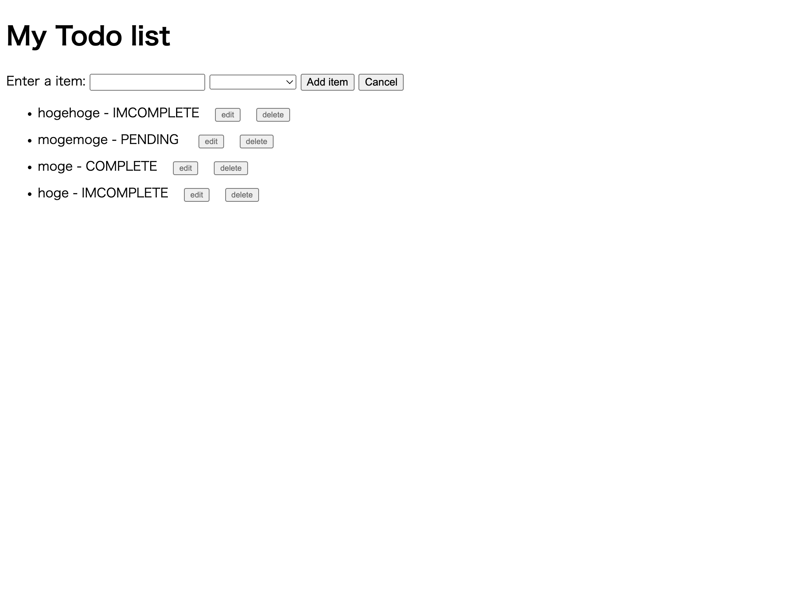

# firestore-tutorial

firestoreの学習用のサンプルコード

`firebase.js` の `firebaseConfig` 内に自身のfirebaseプロジェクトの情報を記載してください。

```js
const firebaseConfig = {
  apiKey: "",
  authDomain: "",
  databaseURL: "",
  projectId: "",
  storageBucket: "",
  messagingSenderId: "",
  appId: "",
};
```

```bash
git clone https://github.com/redimpulz/firestore-tutorial.git
npx serve .
```
## コンソールからFirestoreを操作

http://localhost:3000/

`index.js` 内の試したいコードをコメントインしてください

## Firestoreを使ったTODOアプリ

http://localhost:3000/todo

